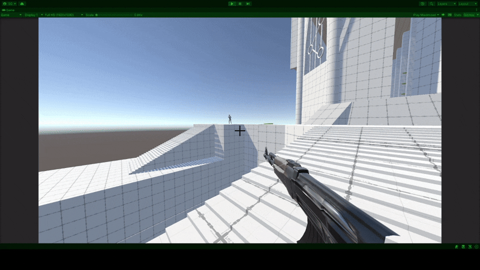
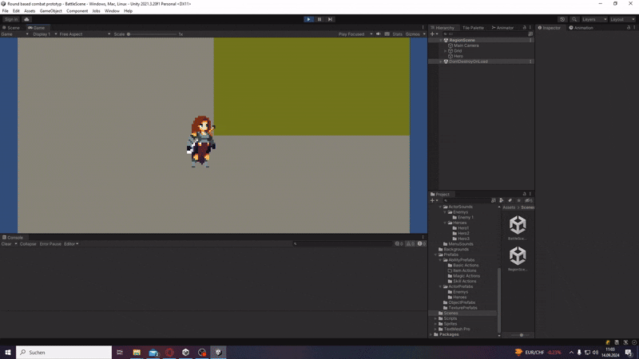

<!-- PROFILE HEADER -->

  <!-- TEXT -->
  

    Hi, I'm <b>Sören Greiner</b> 👋 
    Software Engineer specializing in <b>C# / .NET</b> and <b>.NET MAUI</b>. 
     
    I have experience in application development and <b>migrating from Xamarin to MAUI</b>. 
    This profile also includes various <b>Unity prototypes and gameplay systems</b> from my university projects. 
     
    Currently developing a <b>Sports Tracking App</b> using .NET MAUI, which can be seen <a href="https://github.com/SoerenGreiner/Gym-Logs">here</a>.
  

  <!-- IMAGE -->
  

    
  

  

    
  

## Tech Stack 🛠️

### Languages 💻

### Markup & UI 🎨

### Frameworks & Platforms ⚙️

### Databases 📂

### Developer Tools 🧰

## GitHub Stats 🏆

<!-- Follower & Repositories -->

  
  
  

<!-- Top Languages -->

  
  

## Featured Projects 📱🎮

**Unity FPS** – University project, focus on gameplay mechanics and artificial intelligence.

**Unity Active Time Battle System** – Bachelor thesis project, focus on gameplay mechanics and combat cycle.

**Java Library Management System** – Group project during studies, backend logic, graphical representation and tests implemented.

## Contact ✉️

  
  

